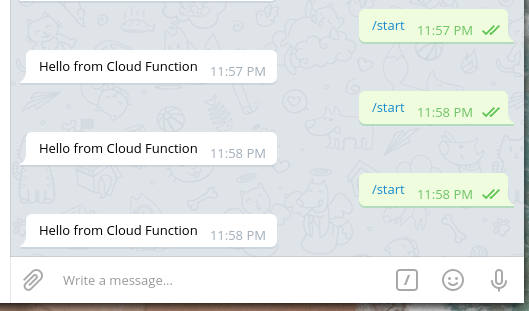

serverless-bot
==============

Serverless Telegram bot template code for use with Firebase Cloud Functions

## Demo
https://telegram.me/serverless_tgbot_example_bot

## Features

- Automatically initializes [`functions.config()`](https://firebase.google.com/docs/functions/config-env) from a local `config.json` file. Includes module that provides the local copy if running inside `firebase serve --only functions`.
- Organized Express.js stack
- Convenient `postdeploy` and `predeploy` actions.
- Code generation with [hygen](https://github.com/jondot/hygen) (Try: `npx hygen route new <name>`)
- OpenAPI integration with [swagger-jsdoc](https://github.com/Surnet/swagger-jsdoc). (See: [Sample](functions/src/lib/languages/route.js))

## Setup

- [Setup the Firebase CLI](https://firebase.google.com/docs/cli)
- [Generate your own repository from this template](https://github.com/au5ton/serverless-bot/generate)
- Clone your repo

    `git clone <YOUR REPOSITORY>`

- Install dependencies (this will generate a `config.json` file)

    `cd functions && npm install`

- Edit `.firebaserc` to represent your Firebase project information.

- Edit `config.json` to set your information. This information is automatically set as [firebase environment](https://firebase.google.com/docs/functions/config-env) configurations in [functions/scripts/predeploy.js](functions/scripts/predeploy.js):

    ```json
    {
        "telegram": {
            "bot_token": "77777777:Alskdjaslkdjasl-kjLKjlkasddd",
            "webhook_secret": "mysecretendpoint"
        },
        "gcp": {
            "datacenter": "us-central1",
            "project_id": "serverless-bot"
        }
    }
    ```
- _(Optional) Write your own bot logic code in [functions/src/lib/bot/controller.js](functions/src/lib/bot/controller.js). For testing your environment and deployment, you can leave it as is and test the build-in `/start` command._

    ```javascript
    // in functions/src/lib/bot/controller.js

    // ...
    const Telegraf = require('telegraf')
    const bot = new Telegraf(config.telegram.bot_token, {
        telegram: { webhookReply: true }
    })

    bot.command('start', ctx => {
        return ctx.reply('Hello from Cloud Function')
    })
    // ...
    ```

- When ready, deploy to Firebase:

    `firebase deploy`

- See if your Telegram bot responds:

    